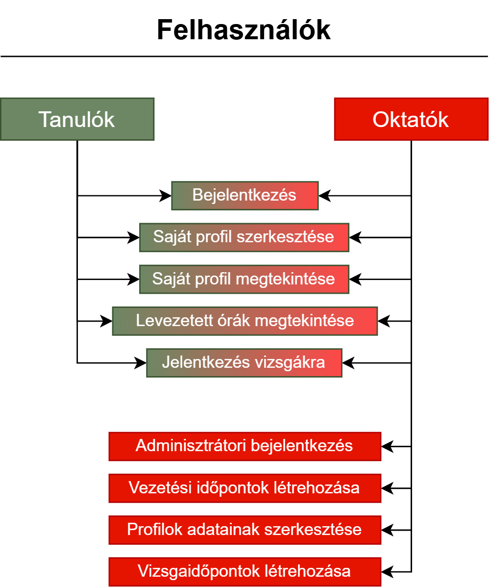

# Funkcionális Specifikáció
## 1. Jelenlegi helyzet
    Az autósiskola, amely az ügyfeleink közé tartozik, kiemelt figyelmet fordít a modern vezetési oktatásra és a tanulók igényeinek megértésére. Jelenleg számos online oktatási portált és blogot üzemeltet, ahol friss híreket és hasznos tanácsokat osztanak meg a biztonságos közlekedésről. Különböző médiafelületeken keresztül gyűjtik a tanulók visszajelzéseit, hogy szolgáltatásaikat tovább fejleszthessék, valamint weboldalukon ösztönzik a diákokat a véleménynyilvánításra.

    Az autósiskola megbízott minket egy vezetési ismeretekhez szükséges portál lértehozásával. A rendszer forráskódja a megrendelő tulajdonába kerül, és fontos szempont, hogy a későbbiekben könnyen bővíthető legyen. Az oldalt a megrendelő fogja működtetni, függetlenül a fejlesztői csapattól.

## 2. Vágyálom rendszer
    Az autóiskola projekt egy Laravel keretrendszerben készül, amely adatbázis-alapú megoldást kínál a tanulók és oktatók adminisztrációs feladatainak kezelésére. 
    A rendszer lehetőséget biztosít arra, hogy felhasználók (tanulóként), oktatóként jelentkezzenek be.

    Tanulóként a felhasználók hozzáférhetnek a levezetett órákhoz, szerkeszthetik a profiluk, követhetik előrehaladásukat különböző fokozatokban (kezdő / haladó), 
    és vizsgajelentkezéseket adhatnak le. Az oktatók, teljes körű adminisztratív jogosultságokkal rendelkeznek: új vizsgákat írhatnak ki, vezetési időpontokat hozhatnak létre vagy módosíthatnak, 
    és kezelhetik a tanulók adatait és viszgaidőpontokat írhatnak.

## 3. Jelenlegi üzleti folyamatok modellje

    A weboldal forrása az autósiskolát fogja illetni, és igényként szerepel annak további bővítési lehetősége is. 
    Elvárás, hogy a kód alapja könnyen újra felhasználható és alapként szolgálhasson a jövőbeli fejlesztésekhez. 
    Az oldal működtetését az autósiskola saját magának fogja végezni, így fontos, hogy a weboldal karbantartásához és moderálásához nem programozói háttérrel rendelkező személyeket terveznek kinevezni. Ennek megfelelően a tervezés és kivitelezés során kulcsfontosságú szempont, hogy minden felmerülő CRUD (Create, Read, Update, Delete) művelethez grafikus felületet biztosítsunk, amely felhasználóbarát és könnyen navigálható. 
    
    A projekt során figyelembe kell venni, hogy az oldal adatbázis-kezelése megfelelően tervezett legyen, megfelelve a szakmai normáknak és az adatbányászati céloknak. 
    A szükséges adatbázis-struktúrákat és relációkat a jövőbeli bővítések figyelembevételével kell kialakítani, lehetővé téve a rugalmas adathasználatot és -kezelést.

    A projekt megvalósítására három hónap áll rendelkezésre, amely alatt a tervezési fázistól a megvalósításig, valamint a tesztelési szakaszig minden lépést alaposan meg kell tervezni és végrehajtani a sikeres bevezetés érdekében.

## 4. Igényelt üzleti folyamatok modellje

## 5. Követelménylista

| Id | Modul | Név | Kifejtés |
| :---: | --- | --- | --- |
| K1 | Főoldal| fő lap | A weboldal fő lapja ahol információk érhetőek el és ide kerül a látogató a weboldal felkeresésekor |
| K2 | Bejelentkezés | Bejelentkezési lap | Bejelentkező felület |
| K3 | Regisztráció | Regisztrációs lap | Regisztrációs felület látogatóknak. |
| K4 | Saját profil megtekintése | Felhasználó lap | A felhasználó megtekintheti a saját adatait ás válzotathat az adatain |
| K5 | Vezetés | Vezetés lap | A felhasználók vezetési órát vehetnek fel és az adminok órákat írhatnak ki és szerkeszthetnek |
| K6 | Vizsga | Vezetés olap | A felhasználók vizsgákat vehetnek fel és az adminok viszgákat írhatnak ki és szerkeszthetnek |
| K7 | Tanulók | Tanulók oldal | Az adminok számára elérhető, szerkeszthetik a tanulók felhasználóját |

## 6. Használati esetek
    A felhasználók (tanulók és oktatók) bejelentkezhetnek a rendszerbe és tanulóként vizsgákat vehetnek fel, 
    vezetési időpontokat foglalhatnak le és szerkeszhetik a profiljukat sikeres jogosítvány szerzés segítésére. 
    Az oktatók vizsgákat, vezetési időpontokat adhatnak meg és szerkeszthetnek, profilopkat szerkeszthetnek. 

## 7. Megfeleltetés, hogyan fedik le a használati eseteket a követelményeket
| Lefedett használati eset | Követelmény | Követelmény azonosító(k) |
| :---: | :---: | :---: |
| 1. | minden látogató regisztrálhat | K3 |
| 2. | regisztrált felhasználók áttekinthetik a statisztikáikat | K1, K2, K4 |
| 3. | regisztrált felhasználók tudhatják mit teljesítettek az eddigiekben, illetve órákra jelentkezhetnek | K1, K2, K5 |
| 4. | oktatók olvashatnak visszajelzéseket | K1, K2, K7 |
| 5. | oktatók új feladványokat tölthetnek fel | K1, K2, K6 |
| 6. | oktatók szerkeszthetnek felhasználói fiókokat | K1, K2, K8 |

## 8. Képernyőtervek

### Korai látványterv

## 9. Forgatókönyvek

## 10. Funkció - követelmény megfeleltetése

| Lefedett használati eset | Követelmény | Követelmény azonosító(k) |
| :---: | :---: | :---: |
| 1. | nemtom1 | K3 |
| 2. | nemtom2 | K1, K2, K4 |
| 3. | nemtom3 | K1, K2, K5 |
| 4. | nemtom4 | K1, K2, K7 |
| 5. | nemtom5 | K1, K2, K6 |
| 6. | nemtom6| K1, K2, K8 |

## 11. Fogalomszótár
+ **profil**: az oldalon való személyazonosság hitelesítéshez szükséges adat halmaz.
    * részei:
        - felhasználó név
        - email cím
        - jelszó
        - jogkör(tanuló/oktató)
		- elérhetőség (bannolva van-e?)
		- előzőleg teljesített elsősegély vizsga
        - Életkor
        - Közoktatási alapvizsga
        - Beiratkozási költségek (kifizette-e a tanfolyamot)
        - KRESZ Vizsga (sikeres/sikertelen)
+ **látogató**: olyan fogyasztó aki nem rendelkezik felhasználói fiókkal.
+ **jogkör**: egy felhasználható által végre hajtható műveletek halmaza.
    * fajtái:
        - látogatói: játék
        - felhasználói: játék (rögzítettve); értékelés írás
        - moderátori: felhasználó; feladvány hozzáadás; felhasználók módosítása; hozzáférés az értékelésekhez
+ **IP**: "Intellectual Property"; Szellemi Tulajdon

