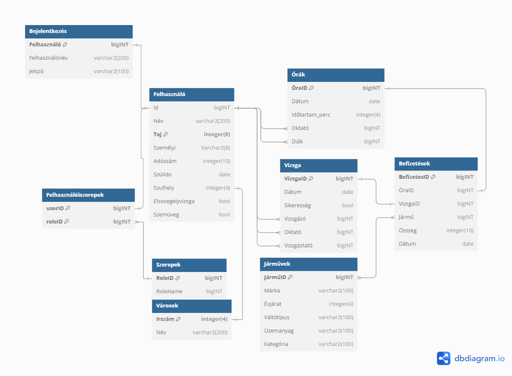

## 1. A rendszer célja

Egy olyan webes alkalmazás készítése(a Laravel és az Angular keretrendszer használatával), ahol diákként tudod kezelni az adataid, oktatóként tudsz létrehozni vizsgákat és órákat, látogatóként pedig az oktatók és járművek adatait lehet megtekinteni.
Az a felhasználó aki nincs felvéve csak általános információkat érhet el az iskoláról. Az adminisztrátoroknak tudnak új felhasználót regisztrálni, a meglévő felhasználóknak különböző jogosultságokkal rendelkeznek, az egyszerű diákok bejelentkezhetnek, megtekinthetik az adataikat meg tudják változtatni azokat és megtekinthetik az eddig vezetett óráikat is. Ezeken felül az oktatók tudnak egy külön bejelentkezési felületen adminisztrátori módban belépni, vezetési időpontokat létrehozni, illetve vizsgaidőpontokat kiírni.

## 2. Projektterv
   
   PHP, HTML, CSS, JavaScript használatával, Laravel és Angular keretrendszerben webalkalmazás létrehozása.
### 2.1 Projektszerepkörök, felelőségek
* Scrum master:
	-   Kovács Bence
* Product owner:
	-   Kovács Bence
* Üzleti szereplő:
	-   Kovács Bence
   
### 2.2 Projektmunkások és felelőségek
   		
* Frontend:
	-   Kökény Kristóf
	-   Török Bálint
* Backend:  
	-   Kadlót Levente
	-   Gál Szabolcs
	-   
* Tesztelés:   
	-   Kadlót Levente
	-   Gál Szabolcs
	-   Kökény Kristóf
	-   Török Bálint
  
### 2.3 Ütemterv
|Funkció                  | Feladat                   | Prioritás | Becslés (nap) | Aktuális becslés (nap) | Eltelt idő (nap) | Határidő (nap) |
|-------------------------|---------------------------|-----------|---------------|------------------------|------------------|---------------------|
|Követelmény specifikáció |Megírás                    |         1 |             1 |                     20 |               19 |                   2 |             
|Funkcionális specifikáció|Megírás                    |         1 |             1 |                     20 |               19 |                   2 |
|Rendszerterv             |Megírás                    |         1 |             1 |                     20 |               19 |                   2 |
|Program                  |Vizuális tervek elkészítése|         2 |            10 |                     20 |               19 |                  14 |
|Program                  |Prototípus elkészítése     |         3 |            14 |                     21 |               19 |                  20 |
|Program                  |Alapfunkciók elkészítése   |         3 |            14 |                     21 |               19 |                  20 |
|Program                  |Extra funkciók elkészítése |         3 |            28 |                     28 |               19 |                  32 |
|Program                  |Tesztelés                  |         4 |            40 |                     40 |               19 |                  49 |

   
### 2.4 Mérföldkövek

   
## 3. Üzleti folyamatok modellje

### 3.1 Üzleti szereplők

   
### 3.2 Üzleti folyamatok

   
## 4. Követelmények

 ### Követelménytáblázat

 | ID | Modul | Név | Kifejtés |
 | :---: | --- | --- | --- |

### Funkcionális
  | Id | Modul | Név | Leírás |
  | :---: | --- | --- | --- |
  | F1 | Főoldal| Főoldal| Kezdő oldal, információkal és az összes gomb elérhető rajta bejelentkezés után |
  | F1 | Bejelentkeztető | Bejelentkeztető | bejelentkezést végrehajtó kód |
  | F2 | Bejelentkeztető | Bejelentkezési lap | oldal amin keresztül a bejelentkezés történik |
  | F3 | Bejelentkeztető | Bejelentkezés ellenörző | felhasználó oldali bejelenkezási form ellenörző |
  | F4 | Regisztrációs | Regisztrálás kezelő | regisztrációt végrehajtó kód |
  | F5 | Regisztrációs | Regisztálási lap | oldal amin keresztül a regisztrálás történik |
  | F6 | Regisztrációs | Regisztálás ellenörző | felhasználó oldali adat ellenörző |
  | F7 | Felhasználó | Felhasználó | felhasználói profil, a felhasználó szerkesztheti |
  | F8 | Vezetés | Vezetés Lista Kezelő | Vezetési listát megjelenítő kód és szerkesztő és jelentkezési tanulók számára kód |
  | F9 | Vezetés | Vezetés Lista lap| Oldal amin keresztűl elérhető a vezetési időpontok listája és tanuló és oktató számára más funkcionális gombok |
  | F10 | Vizsga | Vizsga Lista Kezelő | Vizsga listát megjelenítő kód és szerkesztő és jelentkezési tanulók számára kód |
  | F11 | Vizsga | Vizsga Lista lap| Vizsga amin keresztűl elérhető a vizsga időpontok listája és tanuló és oktató számára más funkcionális gombok |
  | F12 | Tanulók | Tanulók Lista Kezelő | minden regisztrált felhasználót megjelenítő kód, felhasználó kezelő kód |
  | F13 | Tanulók | Tanulók Lista lap | Oldal amin keresztűl elérhető a regisztrált felhasználók listája és szerkeszthetők az adataik |

### Nem Funkcionális
  | ID | Megnevezés | Leírás |
  | --- | --- | --- |
  | K9 | Jogosultság kezelés | Látogató, felhasználó és adminisztrátor megkülönböztetése |
  | K10 | Felhasználó kezelés | Felhasználói fiók létrehozása, adatok tárolása |
  | K11 | Modern felület | Könnyen navigálható felület |

   
## 5. Funkcionális terv

    
### 5.1 Rendszerszereplők
- Látogató
  - Korlátozott hozzáférés.
- Tanuló/Felhasználó
   - Szerkeszti a profilját, viszgát/vezetési időpontot vehet fel.
- Oktató/Adminisztrátor
  - Rendelkezik a felhasználó jogaival, és új viszgát/vezetési időpontot vesz fel vagy szerkeszt, felhasználókat szerkeszt.

   
### 5.2 Menü-hierarchia:
 1. Főoldal
 2. Bejelentkezés
 3. Regisztráció
 4. Profil megtekintése
    *  Profil szerkesztése
 5. Vezetés
 6. Vizsga
 7. Tanulók kezelése 
 8. Kijelentkezés
   
## 6. Fizikai környezet
Laravel által szolgáltatott fejlesztői webszerver fejlesztés során, a kész projekt esetén tényleges webszerver.

### Vásárolt szoftverkomponensek, valamint esetleges külső rendszerek

### Hardver topológia

### Fizikai alrendszerek

### Fejlesztő eszközök

    
## 7. Architekturális terv

### 7.1 Webszerver

Apache webszerver, IIS webszerver, Laravel által nyújtott fejelsztői webszerver

### 7.2 Adatbázis rendszer

MySql relációs adatbázis

    
## 8. Adatbázis terv

## 9. Implementációs terv
A weboldal elkészítéséhez Laravel keretrendszert használunk. Az adatbázist Oracle-ben készítjük el. Az alkalmazás egyes elemei (képek, publikus fájlok, modellek, stb.) külön mappákban találhatóak. A dokumentáció, illetve a weboldalon megjelenő szövegektől eltekintve törekszünk a Magyar nyelv használatára.

## 10. Tesztterv

A tesztelést a fejlesztői csapat minden tagja elvégzi. Az kapott eredményeket mindenki külön fájlban tárolja, pl. markdown fájlokban, excelben vagy wordben. Ezeket külön ID-val, rövid leírással, várt eredménnyel, kapott eredménnyel és megjegyzéssel látjuk el. 

## 10.1 Tesztelési dokumentáció vezetése

| ID | Rövid leírás | Várt eredmény | Kapott eredmény | Megjegyzés |
| :---: | --- | --- | --- | --- |
| TB_001 | Felhasználó bejelentkezés | A felhasználó hiba nélkül be tud jelentkezni | Sikeres bejelentkezés | Mindent rendben találtam |
| TB_002 | Adminisztrátor bejelentkezés | Az adminisztrátor hiba nélkül be tud jelentkezni | Sikeres bejelentkezés | Mindent rendben találtam |

## 10.2 Tesztesetek

| Teszt megnevezése | Elvárt eredmény |
| :---: | --- |
| Regisztráció tesztelése nem megfelelő email címmel. | A webes felület felhívja a figyelmet az email cím helytelenségére, megjelenítve a hibaüzenetet: "Kérjük, adjon meg egy érvényes email címet." |
| Regisztráció tesztelése már létező email címmel. | A rendszer értesíti a felhasználót, hogy az email cím már regisztrálva van, megjelenítve a hibaüzenetet: "Ez az email cím már regisztrálva van." |

## 11. Telepítési terv

    
## 12. Karbantartási terv

