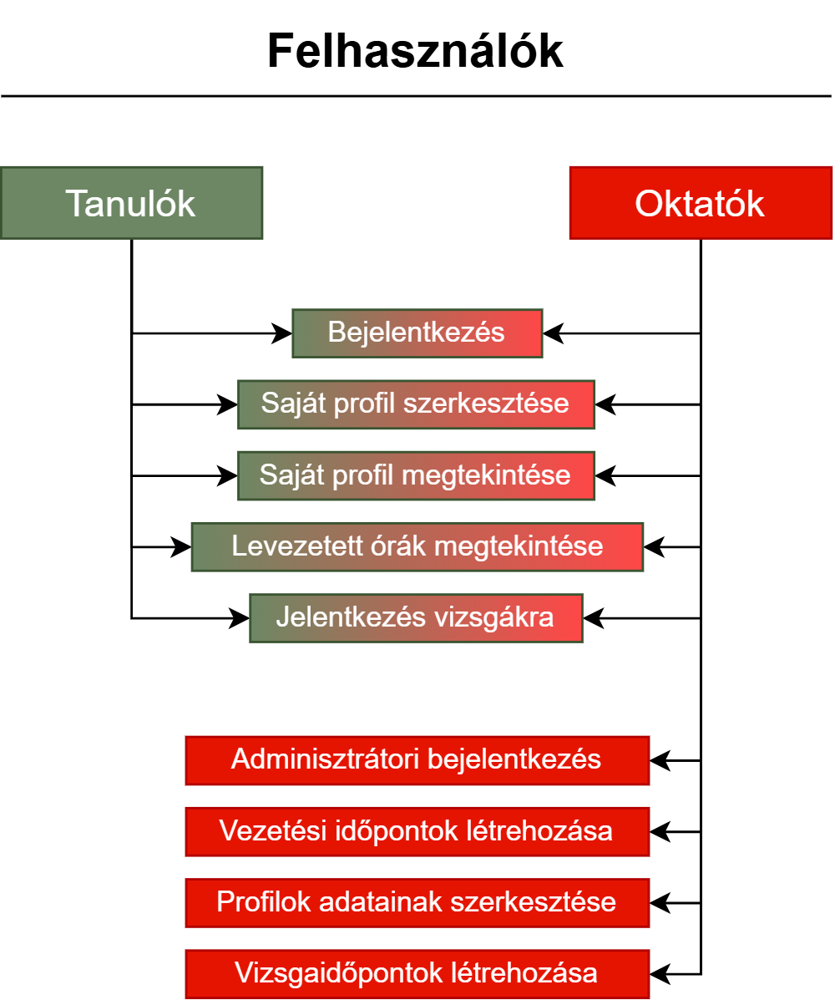

# Funkcionális specifikáció

## 1. Jelenlegi helyzet leírása

Az autósiskola, amely az ügyfeleink közé tartozik, kiemelt figyelmet fordít a modern vezetési oktatásra és a tanulók igényeinek megértésére. Jelenleg számos online oktatási portált és blogot üzemeltet, ahol friss híreket és hasznos tanácsokat osztanak meg a biztonságos közlekedésről. Különböző médiafelületeken keresztül gyűjtik a tanulók visszajelzéseit, hogy szolgáltatásaikat tovább fejleszthessék, valamint weboldalukon ösztönzik a diákokat a véleménynyilvánításra.

## 2. Jelenlegi üzleti folyamatok modellje

## 3. Igényelt üzleti folyamatok modellje

## 4. Követelménylista

## 5. Megfeleltetés, hogyan fedik le a használati eseteket a követelményeket 

## 6. Forgatókönyvek

## 7. Funkció - követelmény megfeleltetése

## 8. Fogalomszótár